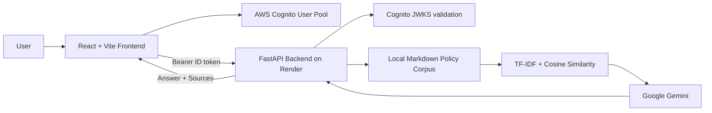

# CloudFin AI

**Financial Policy Intelligence Assistant** — a lightweight college Cloud Computing + portfolio project built with React, FastAPI, AWS Cognito, Gemini, and TF-IDF retrieval.

CloudFin AI lets authenticated users ask natural-language questions against a small curated financial-policy knowledge base. The backend retrieves the most relevant policy sections with TF-IDF + cosine similarity, sends only that context to Gemini, and returns a grounded answer with source attribution.

> The included policy documents are synthetic academic-demo content. This project is not legal, compliance, investment, lending, or personalized financial advice.

## Architecture



## MVP Features

- AWS Cognito sign up, email verification, sign in, session persistence, and logout
- Protected chat routes and backend JWT validation
- React/Vite responsive enterprise-style chat interface
- Local browser conversation history — no database required
- Quick question cards for KYC, AML, credit risk, and loan origination
- Nine Markdown policy documents in the repository
- TF-IDF retrieval with cosine similarity; no embeddings or vector database
- Gemini grounded responses with source attribution
- Admin-only knowledge-base page using the Cognito `admin` group
- Admin knowledge-index refresh endpoint
- Production-minded environment configuration and CORS
- Render-compatible frontend/backend structure

## Technology Stack

| Layer             | Technology                                         |
| ----------------- | -------------------------------------------------- |
| Frontend          | React + Vite                                       |
| Backend           | FastAPI + Python                                   |
| Authentication    | AWS Cognito User Pools                             |
| LLM               | Google Gemini (`gemini-2.5-flash-lite` by default) |
| Retrieval         | scikit-learn TF-IDF + cosine similarity            |
| Knowledge         | Local Markdown files                               |
| Chat history      | Browser localStorage                               |
| Deployment target | Render Static Site + Render Web Service            |

## Repository Structure

```text
cloudfin-ai/
├── backend/
│   ├── main.py
│   ├── pyproject.toml
│   ├── uv.lock                 # generated by `uv sync`
│   ├── .python-version
│   └── .env.example
├── frontend/
│   ├── src/
│   │   ├── App.jsx
│   │   ├── api.js
│   │   ├── auth.js
│   │   ├── main.jsx
│   │   └── styles.css
│   ├── index.html
│   ├── package.json
│   ├── package-lock.json       # generated by `npm install`
│   ├── vite.config.js
│   └── .env.example
├── knowledge/
│   ├── aml.md
│   ├── kyc.md
│   ├── credit_risk.md
│   ├── loan_origination.md
│   ├── customer_due_diligence.md
│   ├── compliance.md
│   ├── information_security.md
│   ├── risk_management.md
│   └── regulatory_guidelines.md
├── .gitignore
└── README.md
```

## 1. Prerequisites

- Python 3.12
- `uv` package manager
- Node.js 20+ and npm
- AWS account for Cognito
- Google AI Studio / Gemini API key
- GitHub account
- Render account

## 2. AWS Cognito Setup

Create an AWS Cognito **User Pool** for the project.

Recommended MVP configuration:

1. Use email as the sign-in identifier.
2. Enable email verification.
3. Create an app client for the browser application **without a client secret**.
4. Keep the default SRP authentication flow available for the app client.
5. Create a Cognito group named exactly `admin`.
6. Add the account you want to use for the admin demonstration to the `admin` group.

Copy these values:

- User Pool issuer, in the form `https://cognito-idp.<region>.amazonaws.com/<user-pool-id>`
- App client ID

The frontend derives the User Pool ID from the issuer URL. The backend validates Cognito ID-token signatures using the pool's JWKS endpoint and checks issuer, expiry, audience, and `token_use`.

## 3. Gemini Setup

Create a Gemini API key and keep it server-side only. Never put it in the frontend `.env` file.

The default model in this project is:

```text
gemini-2.5-flash-lite
```

You can change it with `GEMINI_MODEL` without changing source code.

## 4. Backend Local Setup

```bash
cd backend
cp .env.example .env
```

Edit `backend/.env`:

```env
GEMINI_API_KEY=your_key_here
GEMINI_MODEL=gemini-3.5-flash-lite
FRONTEND_URL=http://localhost:5173
COGNITO_ISSUER=https://cognito-idp.ap-south-1.amazonaws.com/your_user_pool_id
COGNITO_CLIENT_ID=your_app_client_id
```

Install and run:

```bash
uv sync
uv run uvicorn main:app --reload --host 0.0.0.0 --port 8000
```

Useful endpoints:

- `GET /` — application status
- `GET /health` — index + configuration status
- `POST /chat` — authenticated chat
- `GET /sources` — authenticated policy list
- `POST /admin/reload` — admin-only index rebuild

## 5. Frontend Local Setup

Open a second terminal:

```bash
cd frontend
cp .env.example .env
```

Edit `frontend/.env`:

```env
VITE_COGNITO_ISSUER=https://cognito-idp.ap-south-1.amazonaws.com/your_user_pool_id
VITE_COGNITO_CLIENT_ID=your_app_client_id
VITE_API_URL=http://localhost:8000
```

Install and run:

```bash
npm install
npm run dev
```

Open `http://localhost:5173`.

## 6. Authentication Flow

```text
Sign Up
   ↓
AWS Cognito email verification
   ↓
Verify page
   ↓
Sign In
   ↓
Cognito ID token
   ↓
Protected CloudFin chat
```

The app uses a Cognito **ID token** as the bearer token because the backend validates the app-client audience. Passwords are handled by Cognito and are never stored by the FastAPI application.

## 7. Retrieval Flow

```text
Markdown policy files
        ↓
Paragraph-aware chunking (~1,800 chars max)
        ↓
TF-IDF vectorization at backend startup
        ↓
User question vectorization
        ↓
Cosine similarity
        ↓
Top relevant chunks
        ↓
Gemini grounded answer
        ↓
Answer + policy sources
```

If no policy chunk clears the relevance threshold, CloudFin returns a clean “information unavailable” response instead of calling Gemini with unrelated context.

## 8. Admin Demo

The Admin page appears only when the Cognito ID token contains:

```text
cognito:groups = ["admin"]
```

The page shows:

- number of policy documents
- number of indexed chunks
- index status
- policy document list
- **Refresh knowledge base** button

The backend independently checks the `admin` group before allowing `/admin/reload`; hiding the UI is not treated as authorization.

## 9. Render Deployment

### Backend — Render Web Service

Create a new Render Web Service from the GitHub repository.

- **Root Directory:** `backend`
- **Build Command:** `uv sync`

After your first successful local `uv sync`, commit the generated `backend/uv.lock`. You can then use `uv sync --frozen` on Render if you want strict locked builds.

- **Start Command:** `uv run uvicorn main:app --host 0.0.0.0 --port $PORT`

Add backend environment variables:

```text
GEMINI_API_KEY
GEMINI_MODEL=gemini-3.5-flash-lite
FRONTEND_URL=https://YOUR-FRONTEND.onrender.com
COGNITO_ISSUER
COGNITO_CLIENT_ID
```

After deploy, open:

```text
https://YOUR-BACKEND.onrender.com/health
```

### Frontend — Render Static Site

Create a new Render Static Site from the same repository.

- **Root Directory:** `frontend`
- **Build Command:** `npm install && npm run build`
- **Publish Directory:** `dist`

Add frontend environment variables:

```text
VITE_COGNITO_ISSUER
VITE_COGNITO_CLIENT_ID
VITE_API_URL=https://YOUR-BACKEND.onrender.com
```

Then update the backend `FRONTEND_URL` to the actual frontend Render URL and redeploy the backend if needed.

For SPA routing, configure Render to rewrite unknown frontend routes to `/index.html` if your Static Site configuration requires it.

## 10. Recommended College Demo

1. Open the deployed CloudFin frontend.
2. Show Cognito sign-up/sign-in or use a pre-verified demo account.
3. Open the chat dashboard.
4. Ask **“What are the core KYC requirements?”**
5. Show the Gemini answer and policy sources.
6. Ask **“What are common AML escalation indicators?”**
7. Ask an unrelated question to demonstrate the no-match behavior.
8. Sign in with the admin account.
9. Open **CloudFin Administration**.
10. Show the document count, indexed chunks, and refresh function.

This single flow demonstrates cloud authentication, REST APIs, cloud deployment, AI integration, information retrieval, role-aware authorization, and a modern frontend.

## 11. Security Notes

- `.env` files are excluded from Git.
- Gemini API keys are backend-only.
- Cognito passwords are never stored by CloudFin.
- Protected API endpoints validate signed Cognito JWTs.
- Admin operations require the Cognito `admin` group on the backend.
- Production CORS should contain only the deployed frontend URL.
- Chat input is limited to 1,500 characters in the backend request model.
- Do not commit real customer data or confidential policy documents to this student project.

## 12. Intentional MVP Limitations

The MVP does **not** include:

- vector databases
- embeddings
- LangChain / LangGraph
- PyTorch or custom model training
- Docker / Kubernetes
- EC2 / Lambda
- persistent server-side chat storage
- PDF/DOCX upload
- financial prediction or investment recommendations
- loan approval automation

These can be considered only after the deployed MVP is stable.

## Troubleshooting

### Frontend says Cognito is not configured

Check `frontend/.env`, then restart the Vite dev server.

### Backend `/health` says `cognito_configured: false`

Check `backend/.env` and restart FastAPI.

### Backend finds sources but does not generate an answer

Check `GEMINI_API_KEY`. The project intentionally returns a configuration message when Gemini is not configured.

### 401 Invalid or expired token

Sign out and sign back in. Also verify that frontend and backend use the same Cognito User Pool and app client.

### Admin page is missing

Add your Cognito user to the `admin` group, then sign out and back in so Cognito issues a new ID token containing the updated group claim.
